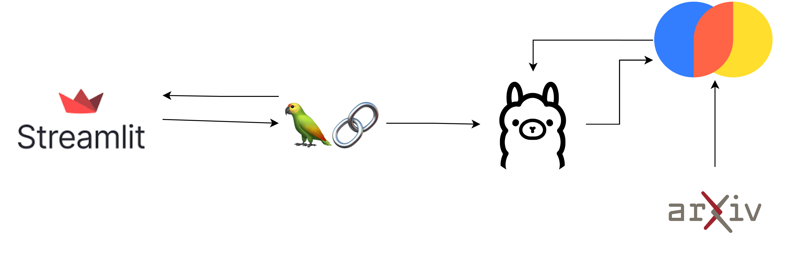

## Research Assistant to Chat with Your Papers Locally  
---  

## About The Project  
A simple **RAG** system to chat with your arXiv papers locally, without any API costs.  
  

### Built With  
- **Ollama** to run open LLMs locally  
- **LangChain** to create the retrieval chain and the conversation prompt  
- **Chroma** as a vector store to store and retrieve embeddings  
- **Streamlit** to build a simple and friendly UI  

### Getting Started  
Run the command `docker-compose up --build` to build and start the services.  
  

#### Customization  
- I used `'phi3:mini'`; feel free to use any other model from [Ollama](https://ollama.com/library).  
- Experiment with chunk size and chunk overlap.  
